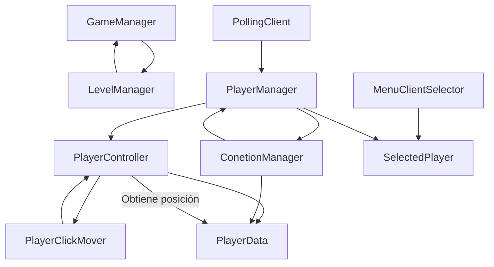

# Elemental Escape - Servidor Dedicado

## 📋 Descripción

**Elemental Escape** es un juego puzzle cooperativo multiplayer basado en **servidor dedicado**. Dos jugadores (Agua y Fuego) deben trabajar juntos para resolver puzzles presionando placas en el orden correcto. El servidor gestiona la lógica del juego, la sincronización de estado y la comunicación con los clientes conectados mediante HTTP polling.

## 🏗️ Arquitectura - Servidor Dedicado

Este proyecto utiliza una arquitectura de **servidor dedicado** donde:

- **Servidor Central**: Gestiona la lógica del juego, validación de acciones y sincronización de estado
- **Clientes**: Se conectan al servidor dedicado mediante polling y reciben actualizaciones del estado del juego
- **Comunicación**: Los clientes envían comandos al servidor y reciben respuestas con el estado actualizado
- **Validación**: El servidor valida todas las acciones para garantizar la integridad del juego

## Setup/Instalación

### Requisitos Previos

- **Unity**: Versión `6000.3.8f1` o superior
- **Git**: Para clonar el repositorio
- **Node.js / Python / .NET**: Depende del servidor dedicado (ver sección servidor)

### Packages Requeridos

Asegúrate de tener instalados los siguientes packages en tu proyecto Unity:

- **Shader Graph**: Para renderizado avanzado de materiales
- **NavMesh**: Para el sistema de navegación de personajes
- **TextMesh Pro**: Incluido por defecto en Unity 2022+ (si no, instálalo desde Package Manager)

### Pasos de Instalación

#### 1. Clonar el Repositorio

```bash
git clone https://github.com/sebas64mil/CubePuzzleServerDedicated.git
cd CubePuzzleServerDedicated
```

#### 2. Abrir el Proyecto en Unity

1. Abre **Unity Hub**
2. Haz clic en **"Add project from disk"**
3. Selecciona la carpeta clonada
4. Asegúrate de que la versión sea `6000.3.8f1`
5. Abre el proyecto

#### 3. Verificar Packages

1. En el editor de Unity, ve a **Window** → **TextMesh Pro** → **Import TMP Essential Resources**
2. Abre **Window** → **Rendering** → **Shader Graph** (debería estar disponible)
3. Ve a **Window** → **AI** → **Navigation** para verificar NavMesh

#### 4. Configurar el Servidor Dedicado

- El servidor dedicado debe estar ejecutándose en Docker o como servicio independiente
- Verifica que el URL del servidor esté configurado en `ConetionManager.cs`
- Por defecto: `http://localhost:5000`

---

 Estructura de Scripts - Carpeta CUbePuzzle

```
Assets/CUbePuzzle/
├── Scripts/
│   ├── Manager/          # Gestores principales del juego
│   ├── Network/          # Lógica de comunicación con el servidor
│   ├── Player/           # Lógica y control del jugador
│   ├── Puzzle/           # Lógica del puzzle (vacío)
│   └── UI/               # Interfaces de usuario (vacío)
├── Scenes/               # Escenas del proyecto
├── Prefabs/              # Prefabs reutilizables
└── Assets/               # Recursos visuales
```

### Descripción de Carpetas

#### 🎮 **Manager/** - Gestores Principales
Contiene los scripts que coordinan los diferentes sistemas del juego:

- **GameManager.cs**: Gestor principal del juego. Coordina el flujo general y estados del juego
- **LevelManager.cs**: Gestiona los niveles del puzzle, su progresión y condiciones de victoria
- **PlayerManager.cs**: Administra los datos y estado de los jugadores
- **SpawnManager.cs**: Controla el spawn/aparición de elementos en el juego
- **ConetionManager.cs**: Gestiona la conexión con el servidor dedicado
- **MenuClientSelector.cs**: Menu para seleccionar cliente/servidor

#### 🌐 **Network/** - Comunicación de Red
Implementa la comunicación cliente-servidor mediante polling:

- **PollingClient.cs**: Cliente que realiza polling al servidor dedicado para obtener actualizaciones del estado del juego

#### 👤 **Player/** - Sistema de Jugador
Contiene toda la lógica relacionada con el control y datos del jugador:

- **PlayerController.cs**: Controla los inputs y comportamiento del jugador
- **PlayerClickMover.cs**: Maneja el movimiento del jugador mediante clicks
- **PlayerData.cs**: Estructura de datos que almacena información del jugador (posición, estado, etc.)
- **SelectedPlayer.cs**: Gestiona el jugador seleccionado actualmente

#### 🧩 **Puzzle/** - Lógica del Puzzle
Contiene los scripts que gestiona la mecánica del puzzle y validación:

- **PuzzleManager.cs**: Gestor principal del puzzle. Valida el orden correcto de las placas presionadas y dispara evento de victoria
- **PressurePlate.cs**: Detección de colisiones que activa cuando un jugador pisa la placa. Controla animaciones y bloqueo de placas
- **VictoryZone.cs**: Define la zona de victoria del nivel. Muestra paneles de victoria personalizados y controla el estado final del juego

#### 🎨 **UI/** - Interfaces de Usuario
Contiene los scripts que manejan los elementos visuales y de interfaz:

- **Clue.cs**: Sistema de pistas interactivas. Muestra un panel con información visual sobre el orden correcto del puzzle
- **SelectedPlayerIndicator.cs**: Indicador visual que muestra qué jugador está actualmente seleccionado/activo

---

## 🚀 Inicio Rápido

1. **Menu de Selector**: Utiliza `MenuClientSelector.cs` para seleccionar entre cliente y servidor
2. **Conexión**: `ConetionManager.cs` establece y mantiene la conexión al servidor dedicado
3. **Comunicación**: `PollingClient.cs` sincroniza el estado mediante polling periódico
4. **Control del Jugador**: `PlayerController.cs` gestiona los inputs del jugador local

## 🔗 Flujo de Datos

```
PlayerController (Input)
    ↓
ConetionManager (Envía al Servidor)
    ↓
Servidor Dedicado (Valida y Procesa)
    ↓
PollingClient (Recibe Actualizaciones)
    ↓
GameManager/LevelManager (Actualiza Estado)
    ↓
PlayerManager/SpawnManager (Actualiza Entidades)
```


## 📊 Diagrama de Flujo de Scripts



## 🎮 Cómo se Juega - Elemental Escape

### Flujo de Juego

**Elemental Escape** es un juego cooperativo donde dos jugadores deben resolver puzzles trabajando en equipo:

#### 1️⃣ Selección de Personaje
- Al iniciar el juego, cada jugador selecciona su elemento:
  - **Jugador 1**: Agua 💧
  - **Jugador 2**: Fuego 🔥
- La selección se realiza en el menú principal
- Cada jugador se conecta al servidor mediante `ConetionManager.cs` usando su ID correspondiente
- La conexión se establece mediante HTTP polling a través de `PollingClient.cs`

#### 2️⃣ Movimiento del Personaje
- Los jugadores se mueven haciendo clic izquierdo en el suelo
- El sistema usa **NavMesh** para calcular la ruta más corta hacia el destino
- `PlayerClickMover.cs` gestiona el movimiento basado en clicks
- `PlayerController.cs` procesa los inputs del jugador
- La posición se actualiza en tiempo real y se sincroniza con el servidor

#### 3️⃣ Sistema de Pistas (Clues)
- Alrededor del mapa hay **pistas visuales** que indican pistas sobre el orden correcto
- Estas pistas están implementadas en `Clue.cs` (UI Script)
- Las pistas guían a los jugadores sobre qué placas de presión deben presionar
- Los jugadores deben observar estas pistas para resolver el orden correcto

#### 4️⃣ Placas de Presión (Pressure Plates)
- El puzzle consiste en presionar **placas de presión en el orden correcto**
- Cada placa tiene un índice (`PlateIndex`) que corresponde a su posición en la secuencia requerida
- Sistema de validación:
  - ✅ **Placa correcta**: La placa se presiona correctamente y avanza el contador (`_expectedIndex`)
  - ❌ **Placa incorrecta**: Si se presiona fuera de orden, se reinicia la secuencia automáticamente
  - Implementado en `PuzzleManager.cs` y `PressurePlate.cs`

#### 5️⃣ Condición de Victoria
- Cuando todas las placas se presionan en el orden correcto:
  - Se dispara el evento `OnPuzzleSolved` en `PuzzleManager.cs`
  - Se muestra un **panel de victoria personalizado** para cada jugador:
    - **Jugador 1 (Agua)**: Panel de victoria con tema acuático
    - **Jugador 2 (Fuego)**: Panel de victoria con tema de fuego
  - El panel contiene un botón para regresar al menú principal

#### 6️⃣ Sistema de Pausa
- Los jugadores pueden pausar el juego en cualquier momento
- La pausa detiene la simulación (Time.timeScale = 0)
- Se abre un menú de pausa que permite:
  - Continuar el juego
  - Reintentar el nivel
  - Regresar al menú principal
- Implementado en `GameManager.cs`

### Descripción de Scripts Clave del Gameplay

| Script | Función |
|--------|---------|
| `PlayerController.cs` | Procesa inputs del jugador y controla comportamiento |
| `PlayerClickMover.cs` | Maneja el movimiento basado en clicks con NavMesh |
| `PlayerData.cs` | Almacena posición, estado y datos del jugador |
| `PuzzleManager.cs` | Valida el orden de las placas y dispara evento de victoria |
| `PressurePlate.cs` | Detección de colisiones y animación de placas presionadas |
| `Clue.cs` | Muestra pistas visuales en el mapa |
| `VictoryZone.cs` | Define la zona de victoria del nivel |
| `GameManager.cs` | Gestiona pausa, reinicio y cambio de escenas |

---

## 🌐 Sistema de Conexión HTTP

**Elemental Escape** utiliza conexiones HTTP mediante un servidor dedicado en Docker para sincronizar el estado del juego entre los jugadores.

### Arquitectura de Comunicación

```
Cliente 1 (Jugador 1 - Agua)
    ↓
    ├─→ [HTTP Request] GET /api/game/{gameId}/player/1
    ├─→ [PollingClient realiza polling cada X ms]
    └─→ [HTTP Response] JSON con estado del juego
    
Servidor Docker Dedicado
    ↓
    └─→ [Valida y procesa acciones]
    └─→ [Sincroniza estado con ambos jugadores]
    
Cliente 2 (Jugador 2 - Fuego)
    ↓
    ├─→ [HTTP Request] GET /api/game/{gameId}/player/2
    ├─→ [PollingClient realiza polling cada X ms]
    └─→ [HTTP Response] JSON con estado del juego
```

### Componentes Principales

#### **PollingClient.cs** - Cliente HTTP de Polling
- **Función**: Realiza solicitudes HTTP periódicas al servidor para obtener actualizaciones
- **Método**: GET request a `{BaseUrl}/{GameId}/{PlayerId}`
- **Intervalo**: Configurable (típicamente 100-500ms)
- **Características**:
  - Realiza polling asincrónico sin bloquear el hilo principal
  - Maneja reintentos automáticos en caso de error
  - Dispara evento `OnJsonReceived` cuando recibe datos
  - Compatible con CancellationToken para detener el polling

```csharp
// Ejemplo de uso
var client = new PollingClient("http://localhost:5000/api", "game123", TimeSpan.FromMilliseconds(200));
await client.StartPollingAsync(new[] { 1, 2 }); // Inicia polling para jugadores 1 y 2
```

#### **ConetionManager.cs** - Gestor de Conexión
- **Función**: Establece y mantiene la conexión con el servidor dedicado
- **Responsabilidades**:
  - Inicializar `PollingClient` con los parámetros del servidor
  - Enviar acciones del jugador al servidor
  - Recibir y procesar actualizaciones del estado del juego
  - Manejar reconexiones automáticas en caso de desconexión

### Protocolo HTTP

#### Request (Cliente → Servidor)
```
GET /api/game/{gameId}/{playerId}
Host: servidor-docker:puerto
```

**Parámetros**:
- `gameId`: ID único de la partida
- `playerId`: ID del jugador (1 para Agua, 2 para Fuego)

#### Response (Servidor → Cliente)
```json
{
  "playerId": 1,
  "position": { "x": 10.5, "y": 0, "z": 15.2 },
  "state": "playing",
  "pressedPlates": [0, 1],
  "timestamp": 1234567890
}
```

**Campos de respuesta**:
- `playerId`: ID del jugador
- `position`: Posición actual del personaje (X, Y, Z)
- `state`: Estado actual (playing, paused, victory, etc)
- `pressedPlates`: Array de índices de placas que se han presionado en orden
- `timestamp`: Marca de tiempo del servidor

### Flujo de Sincronización

1. **Inicio**: El jugador selecciona su elemento (Agua/Fuego)
2. **Conexión**: `ConetionManager` crea un `PollingClient` e inicia polling
3. **Solicitud**: Cada ~200ms, se envía GET request con el ID del jugador
4. **Respuesta**: El servidor devuelve el estado actual del juego
5. **Actualización**: `GameManager` y `PuzzleManager` actualizan los datos locales
6. **Sincronización**: Ambos jugadores mantienen el mismo estado

### Manejo de Errores

- **Timeout**: Se reintentan automáticamente sin detener el juego
- **Desconexión**: El sistema intenta reconectar periódicamente
- **Datos inválidos**: Se validan antes de procesarlos
- **Cambio de escena**: Detiene el polling automáticamente

---

## 📸 Pantallazos del Juego

### 1. Menú Principal

*Descripción: Pantalla de inicio con opciones para comenzar o salir*

### 2. Selección de Personaje

*Descripción: Pantalla donde el jugador elige entre Agua (Jugador 1) o Fuego (Jugador 2)*

### 3. Vista del Juego - Gameplay

*Descripción: Vista en juego mostrando el mapa con placas de presión, pistas y el personaje del jugador*

### 4. Sistema de Pistas

*Descripción: Detalle de las pistas visuales distribuidas en el mapa que guían el orden correcto*

### 5. Menú de Pausa

*Descripción: Menú de pausa con opciones para continuar, reintentar o regresar al menú principal*

### 6. Panel de Victoria - Jugador 1 (Agua)

*Descripción: Pantalla de victoria personalizada para el Jugador 1 con tema acuático*

### 7. Panel de Victoria - Jugador 2 (Fuego)

*Descripción: Pantalla de victoria personalizada para el Jugador 2 con tema de fuego*

---

## 🧪 Testing con Multiplayer Center

### Estrategia de Testing

Para probar **Elemental Escape** sin necesidad de exportar el juego, se utiliza el **Multiplayer Center de Unity** en el Editor. Esto permite simular dos instancias simultáneamente: una con el jugador por defecto y otra con el Player 2, permitiendo verificar toda la funcionalidad multiplayer directamente en la consola de Unity.

### Configuración del Multiplayer Center

#### 1. Habilitar Multiplayer Center en Unity Editor

1. Abre **Window** → **Multiplayer** → **Multiplayer Center**
2. En el panel que aparece, verás opciones para ejecutar múltiples instancias del juego
3. Configura para ejecutar **2 instancias**:
   - **Instancia 1**: Player por defecto (Jugador 1 - Agua)
   - **Instancia 2**: Player 2 (Jugador 2 - Fuego)

#### 2. Ejecución Simultánea

```
┌─────────────────────────────────────┐
│   Unity Editor - Editor Instance    │
│  (Jugador 1 - Agua)                 │
│  Console Log visible                │
└─────────────────────────────────────┘

┌─────────────────────────────────────┐
│   Instancia Player 2                │
│  (Jugador 2 - Fuego)                │
│  Console Log visible                │
└─────────────────────────────────────┘
```

- **No es necesario exportar** el juego a .exe o .apk
- Ambas instancias comparten los mismos assets y scripts
- Se pueden ver los console logs de ambas instancias en tiempo real

### Ventajas de Este Enfoque

✅ **Sin exportar**: No necesitas compilar ni exportar el juego  
✅ **Logs en tiempo real**: Ve exactamente qué está pasando en ambas instancias  
✅ **Debugging rápido**: Pausa el juego y inspecciona variables  
✅ **Profiler integrado**: Analiza performance sin overhead de exportación  
✅ **Source code access**: Accede al código fuente directamente mientras pruebas  
✅ **Cambios en caliente**: Modifica scripts y recarga sin reiniciar completamente


## 📊 Estado del Proyecto

**Estado Actual**: `ALPHA` 🔶

- Funcionalidad de juego base operativa
- Comunicación cliente-servidor mediante HTTP polling implementada
- Sistema de puzzles y mecánicas principales en desarrollo activo
- Testing y optimización en progreso

---

## 📜 Licencia

Este proyecto está bajo licencia **MIT**. Consulta el archivo `LICENSE` para más detalles.

---

## 👨‍💻 Contacto y Créditos

**Desarrollador Principal**: Sebastián  
**GitHub**: [@sebas64mil](https://github.com/sebas64mil)  
**Repositorio**: [CubePuzzleServerDedicated](https://github.com/sebas64mil/CubePuzzleServerDedicated)

### Colaboradores

- **Diseño de Puzzles**: [Elisa Ingilar]
- **Arte y Visuels**: [Kathe Guayazan]

---

